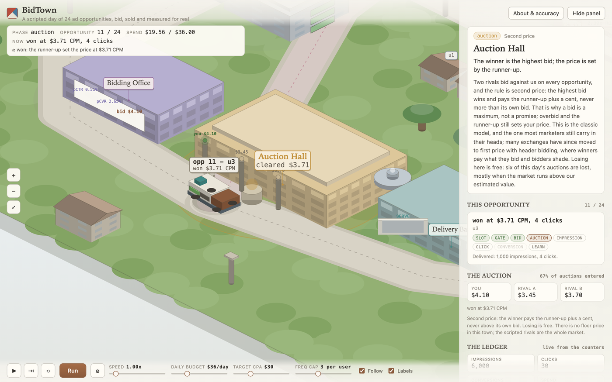

# BidTown

BidTown is an isometric ad-tech town that plays one scripted day of 24 ad
opportunities and computes a real campaign's response to it.
A bid request leaves The Page, passes the Gatehouse (audience, frequency,
budget), gets a price at the Bidding Office from pCTR x pCVR x target CPA,
races two scripted rivals in the Auction Hall under second pricing, and only if
it wins is the creative served, billed, clicked, maybe converted, and folded
back into the estimates at the Performance Office - where the next bid is born.

On the default settings the day delivers 11 blocks (11,000 impressions),
61 clicks and 2 conversions on a $38.50 spend: a $3.50 CPM, a 0.55 percent CTR
and a $19.25 CPA against a $30 target, with every metric tieing back to the
four counters by arithmetic and nothing else.
Raise the daily budget and the twelfth block carries a third conversion the
default could not afford.



## Run it

Open `index.html` in a browser - a static site with no build step, no
dependencies and no network calls, so `file://` works.

For the checks:

```bash
npm test                 # the campaign model against hand-derived values
npm i -D playwright && npx playwright install chromium
npm run serve            # python3 -m http.server 8001, in one terminal
npm run smoke            # headless: console errors, every station, a screenshot
```

Look at the screenshot the smoke test writes. A canvas app fails silently:
occlusion, label collisions and plates on empty ground raise no errors.

## Controls

| Control | Behaviour |
|---|---|
| **Space** | play / pause. Holds a reading stop indefinitely. |
| **S** | advance exactly one station, then pause. |
| **R** | reset and replay the slow tour. |
| **F** | follow camera. **L** labels. |
| **Speed** | 0.4x to 8x; scales everything, reading stops included. |
| **Daily budget** | the pacing cap. Changing it restarts the day; the tour survives. |
| **Target CPA** | scales the bid through the formula. |
| **Freq cap** | per-user block limit. |

## The journey

| Station | Model step | Gated |
|---|---|---|
| The Page | the bid request is born: one opportunity from the script | no; fires on every lap. It also carries the day's end: when the script is out, the page stops the run. |
| The Gatehouse | audience, then frequency, then budget; the first failing check is why the bid was passed | no; it reports pass or block. |
| Bidding Office | the estimates and the bid: pCTR x pCVR x target CPA, clamped to [$0.10, $20.00] | yes: skipped when the gate passed on the bid. |
| Auction Hall | our bid against two scripted rivals; strictly highest wins; pays runner-up + $0.01, never above its own bid | yes: only laps that made a bid. |
| Delivery Bay | the winning creative is served: one 1,000-impression block billed at the clearing CPM | yes: only wins. |
| Turnstile | the block's scripted clicks are counted; CPM billing means no extra cost | yes: only wins. |
| Checkout | the scripted conversions (+$45 each, last-click attribution) | yes: only laps that converted. |
| Performance Office | the ledger identities and the learning update: estimates recomputed from the counters, next bid derived | yes: only laps that delivered. |

Blocked laps take the green PASS road straight back to The Page; lost auctions
take the pink LOSS road. Most laps in a real account - and several here - are
short.

## Pacing

The first time the van reaches a station it stops for as long as that station's
write-up takes to read: `min(26, max(9, words / 3.8 + 3.5))` seconds, with a
progress bar under the panel text. Later visits get a 1.4 to 1.8 second beat,
divided by 3 once the tour is done. Once every district has been explained -
the checkout and the turnstile arrive with the script's first win and first
conversion, inside the first three opportunities - travel speeds up 6.5x.

A full first pass at 1x measures about six minutes, with the whole guided tour
read by the fourth minute. The smoke test finishes the day in about a minute of
test time with `node scripts/smoke.mjs <url> --steps 320`.

**Run** keeps what you have read; **Reset** (⟲) replays the slow tour.

## How much of it is real

**Genuinely computed, live, in your browser:** the three gate checks; the
per-user frequency counts; the smoothed estimates and their priors; the
target-CPA bid and its clamp; the auction outcome and the runner-up clearing,
rounded to cents; the billing; the counters; every metric identity (CPM, CTR,
CVR, CPC, CPA, ROAS); the pacing arithmetic; and the update that moves the next
bid. All of it lives in `js/model.js`, and `test/model.test.mjs` checks it
against values worked out by hand before the model ran, plus four direct cases
of the auction rule.

**Scaled:** one opportunity is a 1,000-impression block rather than a single
impression, so a 24-lap day can carry real dollars; the auction logic itself is
unchanged.

**Assumed:** the $45 average order value; the prior pseudo-counts
((clicks + 10) / (impressions + 2000) and (conversions + 5) / (clicks + 200));
the bid clamp; hard-cap pacing instead of smooth probabilistic pacing; second
price instead of first price with bid shading; no floor price; last-click
attribution only.

**Scripted, not simulated:** the rival bids, the audience flags, the user map
(two users per four rows of the script) and the clicks and conversions the
audience produces. The script is fixed data in `js/model.js`; the campaign's
response to it is arithmetic.

**Deliberately faked:** the buildings, the roads and the fountain. Nothing
numeric: every number on the panel and on the map comes out of the machine.

## Files

```
index.html             markup, controls, the About modal with the fidelity ledger
css/styles.css         the light print-like shell around the canvas
js/iso.js              ENGINE: projection, solids, routes (copied unchanged)
js/model.js            THE LESSON: the campaign, the scripted day, the auction
js/world.js            the static place: routes, stations, districts, landmarks
js/sim.js              the state machine: chained laps, gated stations, the day's end
js/render.js           one sorted painter's pass + the landmark functions
js/ui.js               DOM panels, controls, narration
js/main.js             ENGINE: canvas, camera, input, frame loop
docs/knowledge-base.md the reviewed programmatic foundations and the model spec
docs/review.md         the accuracy review and a real bug the tests found
test/model.test.mjs    the campaign against hand-derived values
scripts/smoke.mjs      headless verification (console errors, every station)
scripts/shots.mjs      dev harness: screenshots at chosen moments
```

## Architecture notes

The journey is six chained routes, and every decision the model made picks the
next leg. `sim.js`'s `advanceRoute()` reads the trace of the opportunity in
hand: blocked takes PASS, lost takes LOSS, clicked goes through the checkout,
everything else rejoins at the office. A station with a gate in `GATES` is
driven past on laps where its event did not happen, which is why a passed
opportunity is a 10-second lap and a converting one is a full tour.

The van's gauge is the bid itself against an $8 scale, and the bid masts carry
the actual numbers - so the second-price rule can be checked by eye: the mast
that lights is the winner, and the clearing always reads the runner-up plus a
cent.

## Credits

Built with the isometric-explainer skill by Laurentiu Raducu, whose technique
(and whose TokenTown and EngineWorks explainers) this follows; the city-shaped
system idea goes back to PGSimCity. All code and copy here are original.
MIT licensed.
